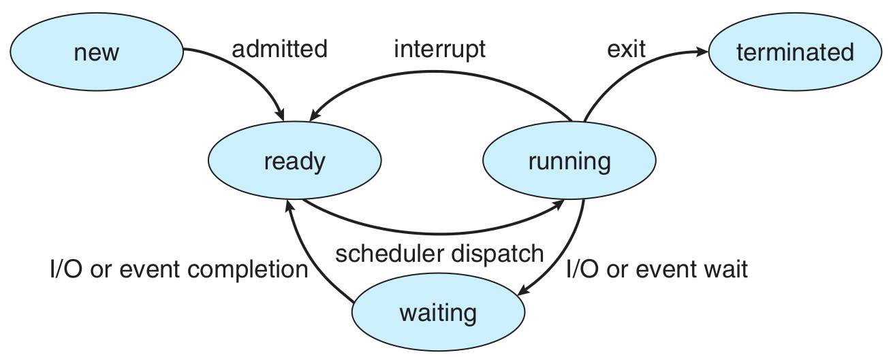

# Learn Operating System Basic Concept

## Thread 

## Address Space

## Process

A process is a **program in execution**.
The status of current activity of a process is **PC**.  

### State / Life Cycle

#### New 

The process is being created.

#### Ready

The process is waiting to be assigned to a processor.

#### Running

Instructions are being executed.

- system call
- interrupt
- exception

#### Waiting

The process is waiting for some event to occur (such as an I/O completion or reception of a signal)

- interruptible wait

#### Terminated

The process has finished execution.

#### Transition

### Process Control Block (PCB)

#### Process state

new, ready, running, waiting, terminated

#### Program Counter

Indicates the address of the next instruction to be executed for this process.

#### CPU registers

accumulators, index registers, stack pointers... + condition-code information

#### CPU-scheduling information

process priority, pointers to scheduling queues...

#### Memory-management information

value of the base, limit registers, page tables, segment tables

#### Accounting information

used CPU, real time, time limits, account numbers, job or process numbers...

#### I/O status information

the list of I/O devices allocated to the process, a list of open files...

## Mode

| | User Mode | Kernel Mode
-- | -- | --
mode bit | 1 | 0

### Kernel

- task list
  - processes are arranged as a double linked list

### Mode Switch

1. System call
2. Interrupt
3. Exception