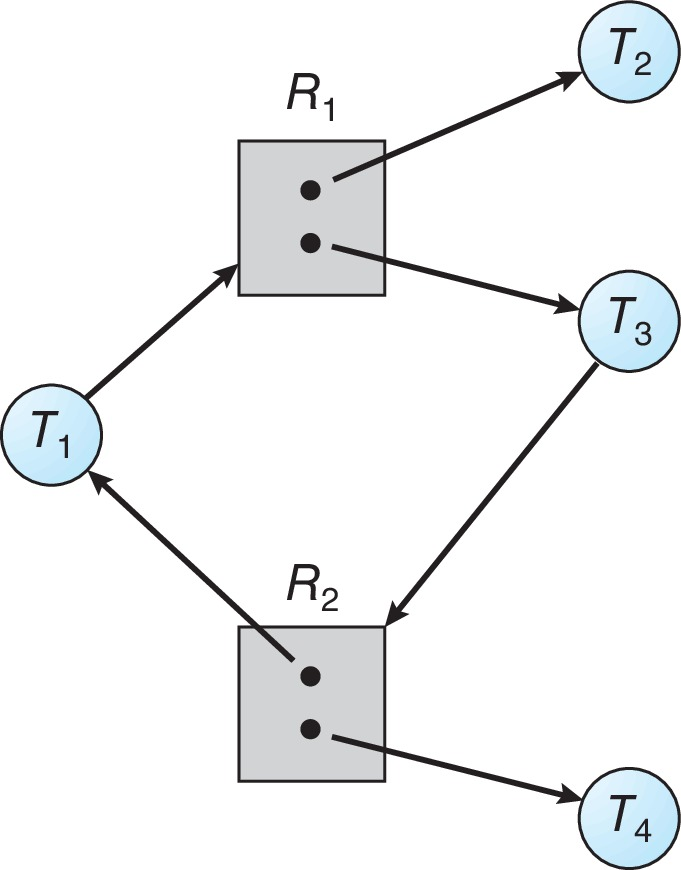

# Deadlock

## System Model

A system consists of a finite number of **resources** to be distributed among a number of **competing threads**.

Thread utilize resource:

1. **Request**
2. **Use**
3. **Release**

## Necessary Conditions

1. **Mutual exclusion**. At least one resource must be held in a non-sharable mode; that is, only one thread at a time can use the resource. If another thread requests that resource, the requesting thread must be delayed until the resource has been released.
2. **Hold and wait**. A thread must be holding at least one resource and waiting to acquire additional resources that are currently being held by other threads.
3. **No preemption**. Resources cannot be preempted; that is, a resource can be released only voluntarily by the thread holding it, after that thread has completed its task.
4. **Circular wait**. A set {T 0 , T 1 , ..., T n } of waiting threads must exist such that T 0 is waiting for a resource held by T 1 , T 1 is waiting for a resource held by T 2 , ..., T n−1 is waiting for a resource held by T n , and T n is waiting for a resource held by T 0 .

## Resource-Allocation Graph

- V: vertices
  - P: processes
  - R: resources

- E: edges
  - request edge: P->R, request a type
  - assignment edge: R->P, assign an instance

- request before release

- If graph contains no cycles -> no deadlock

- If graph contains a cycle

  - if only one instance per resource type, then deadlock
  - if several instances per resource type, possibility of deadlock

  

## Prevention

- **Mutual Exclusion** – not required for sharable resources (e.g., read-only files); must hold for non-sharable resources
- **Hold and Wait** – must guarantee that whenever a process requests a resource, it does not hold any other resources
  - Require process to request and be allocated all its resources before it begins execution, or allow process to request resources only when the process has none allocated to it.
  - Low resource utilization; starvation possible

- **No Preemption**
  - If a process that is holding some resources requests another resource that cannot be immediately allocated to it, then all resources currently being held are released
  - Preempted resources are added to the list of resources for which the process is waiting
  - Process will be restarted only when it can regain its old resources, as well as the new ones that it is requesting

- **Circular Wait** – impose a total ordering of all resource types, and require that each process requests resources in an increasing order of enumeration
  - most common
  - Simply assign each resource (i.e. mutex locks) a unique number.
  - Resources must be acquired in order.

## Avoidance

- Simplest and most useful model requires that each process declare the **maximum number** of resources of each type that it may need
- The deadlock-avoidance algorithm dynamically examines the resource-allocation state to ensure that there can never be a circular-wait condition
- Resource-allocation state is defined by the number of available and allocated resources, and the maximum demands of the processes

### Safe State

- If Pi resource needs are not immediately available, then Pi can wait until all Pj have finished
- When Pj is finished, Pi can obtain needed resources, execute, return allocated resources, and terminate
- When Pi terminates, Pi +1 can obtain its needed resources, and so on

When a process requests an available resource, system must decide if immediate allocation leaves the system in a safe state. 

- If a system is in safe state -> no deadlocks
- If a system is in unsafe state -> possibility of deadlock
- Avoidance -> ensure that a system will never enter an unsafe state

### Avoidance Algorithms

#### Single instance of a resource type (Use a resource-allocation graph)

The request can be granted only if converting the request edge to an assignment edge does not result in the formation of a cycle in the resource allocation graph

#### Multiple instances of a resource type (Use the Banker’s Algorithm)

##### Data structures

Let n = number of processes, and m = number of resources types. 

- **Available:**  Vector of length m. If available [j] = k, there are k instances of resource type Rj  available
- **Max:** n x m matrix.  If Max [i,j] = k, then process Pi may request at most k instances of resource type Rj
- **Allocation:**  n x m matrix.  If Allocation[i,j] = k then Pi is currently allocated k instances of Rj
- **Need:**  n x m matrix. If Need[i,j] = k, then Pi may need k more instances of Rj to complete its task
  - Need [i,j] = Max[i,j] – Allocation [i,j]