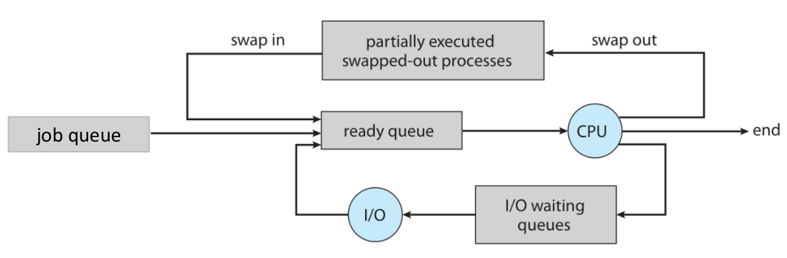

# Scheduling

## Context Switching

- block / wait
- POSIX signal
- interrupt
- round-robin
- preemptive

### cost

#### direct cost in kernel

- save and restore registers
- switch address space (expensive instructions)

#### indirect cost in kernel

- cache
- buffer
- TLB miss

## Process Scheduling

Multiprogramming
- processes running at all times so as to maximize CPU utilization.
- degree: number of processes currently in memory
- number of running process = number of cores

CPU-bound process:
- user time > sys time 
- do more computations than I/O 

I/O-bound process: 
- sys time > user time
- do more I/O than computations

### Scheduling Queues

### preemptive

### algorithms

#### input tasks

- arrival time
- CPU requirement

#### online vs offline

#### algorithm evaluation

- number of **context switches**
- individual & average **waiting time**
- individual & average **turnaround time**

individual turnaround time = **finish time - arrival time**  
individual waiting time = **turnaround time - required time**

#### shorest job first (SJF)

##### non-preemptive SJF

waiting time = turnaround time - required time  
longer time, little content switches

##### preemptive SJF 

shorter time, many content swtiches

#### Round-Robin

Each process has a quantum number. When all processes have 0 quantum, recharge is executed. Context swtich is needed even there is only one process left.
worse than SJF, but easier to implement

#### Priority Scheduling

Linux use multiple priority queues

